# 面向多感官调制的非联想学习忆阻神经形态电路

> **Bio-Inspired Neuromorphic Circuit Design of Non-Associative Learning for Multisensory Enhancement and Depression**

**蒋彦熙** · 哈尔滨工业大学 · 指导教师：王紫璐

`#忆阻器` · `#神经形态电路` · `#类脑计算` · `#非联想学习` · `#多感官整合` · `#OrCAD` · `#PSpice`

---

## 📌 一句话看懂

> 五条要点，概括项目在做什么、解决了什么，以及仓库包含哪些材料。

- 🧠 **做什么**：用**忆阻器**（一种阻值可变的电子器件，类似人工突触）搭建可仿真的类脑感知电路，让芯片像生物一样「学会」对刺激作出反应。
- 🔧 **解决什么**：修复忆阻模型「一到边界就卡死」的缺陷，并独立设计**共存检测**电路，判断多路信号是否真正「同时出现」。
- 🎯 **做到什么**：在**同一块电路**上跑通非联想学习、多感官增强/抑制、方向性跨通道联想——多数文献只实现其中一两项。
- 💡 **核心改动**：忆阻模型改进与共存检测电路均为**独立提出并实现**，配套完整 OrCAD 工程、论文与仿真数据，可直接复现。
- 📂 **归档内容**：论文终稿 · 全部阶段 PPT · 三通道电路工程 · 仿真波形 CSV · README 图文说明。

---

## 项目卡片

**忆阻器类脑神经形态电路** — 三通道可仿真系统，实现非联想学习、多感官整合与方向性联想记忆。

| | |
|:--|:--|
| **技术栈** | OrCAD · PSpice · AIST 忆阻 SPICE 建模 · Python 波形后处理 |
| **核心产出** | 可仿真电路工程 · 论文终稿 · 组会与设计笔记 · 仿真 CSV 与复现脚本 |
| **两大改动** | [忆阻模型改进](#忆阻模型改进) · [共存检测与方向性突触](#共存检测与方向性突触) |
| **章节跳转** | [核心贡献](#-核心贡献) · [能力体现](#能力体现) · [主要仿真结果](#-主要仿真结果) · [环境配置](#环境配置) · [过程材料](#-文档与过程材料) |

> **落地场景** — 该电路架构可面向低功耗人工感知芯片，为边缘端多模态智能传感器提供类脑学习与感官整合能力。

##技术栈明细

| 类别 | 技术 / 工具 | 本项目应用 |
|------|-------------|------------|
| **器件建模** | AIST 阈值忆阻模型 · Biolek 分向窗函数 · SPICE 子电路（`.lib`） | 修复边界锁死，支撑 MS/ME 忆阻长时序可逆变化 |
| **电路设计** | OrCAD Capture · 比较器 / DFF / PMOS 门控 · 忆阻交叉阵列 | 四功能模块 + 共存检测子电路 + 三通道系统集成 |
| **仿真验证** | PSpice · 40 s 级联仿真 · 波形 CSV 导出 | NAL 四过程、MSE/MSD、方向性权值演化全链路验证 |
| **数据处理** | Python 3.10+ · pandas · matplotlib · `draw.py` | PSpice 导出 CSV 的后处理与波形复现 |

<details>
<summary><strong>全文目录</strong>（点击展开章节导航）</summary>

**概览**

- [一句话看懂](#-一句话看懂)
- [项目卡片](#项目卡片)
- [阅读指引](#阅读指引)
- [关于本项目](#关于本项目)

**成果与验证**

- [主要仿真结果](#-主要仿真结果)
- [核心贡献](#-核心贡献)
- [能力体现](#能力体现)
- [个人工作边界](#个人工作边界)
- [与现有工作对比](#与现有工作对比)

**技术专节**

- [忆阻模型改进](#忆阻模型改进)
- [共存检测与方向性突触](#共存检测与方向性突触)
- [系统架构](#系统架构)
- [仿真结果](#仿真结果)
- [拓展应用](#拓展应用)

**工程与归档**

- [仓库结构](#仓库结构)
- [环境配置](#环境配置)
- [文档与过程材料](#-文档与过程材料)
- [探索性分支](#探索性分支)
- [引用](#引用)

<sub>术语表、SPICE 代码、子模块链路等深度内容已折叠，可在各技术专节内展开查看。</sub>

</details>

---

## 阅读指引

| 关注点 | 可从这些章节入手 |
|--------|------------------|
| 项目概览 | [项目卡片](#项目卡片) → [主要仿真结果](#-主要仿真结果) → [核心贡献](#-核心贡献) → [能力体现](#能力体现) |
| 设计过程与材料 | [文档与过程材料](#-文档与过程材料) → [个人工作边界](#个人工作边界) |
| 技术细节 | [忆阻模型改进](#忆阻模型改进) → [共存检测与方向性突触](#共存检测与方向性突触) → [仿真结果](#仿真结果) |
| 复现与运行 | [环境配置](#环境配置) → [`memtest/`](memtest/) · [`memristor/`](memristor/) → [`simulation/`](simulation/) |
| 查阅全文 | [`docs/thesis/final/`](docs/thesis/final/) · [`docs/presentations/final/`](docs/presentations/final/) |

---

<details>
<summary><strong>术语与关键词</strong>（点击展开）</summary>

后文将反复出现若干专业名词，此处先行统一说明。

#### 核心概念

| 术语 | 英文 | 说明 |
|------|------|------|
| **忆阻器** | Memristor | 阻值随所加电压历史而变化的电子元件，可模拟生物突触的记忆与可塑性 |
| **神经形态电路** | Neuromorphic Circuit | 模仿生物神经系统结构与信息处理方式的电路，在硬件层面实现学习与记忆 |
| **非联想学习** | Non-Associative Learning (NAL) | 对单一刺激产生的适应与调制，包括习惯化、敏感化、去习惯化、自发恢复 |
| **多感官整合** | Multisensory Integration (MSI) | 神经系统整合来自不同感官通道信息的过程 |
| **多感官增强** | Multisensory Enhancement (MSE) | 多种刺激共现时，彼此关联响应被强化 |
| **多感官抑制** | Multisensory Depression (MSD) | 刺激非共现或无关时，跨通道关联被削弱 |
| **共存检测** | Coexistence Detection (CD) | 判定多路信号是否在有效时间窗内「共现」，作为触发联想学习的前提条件 |
| **方向性突触** | Directional Synapse | 突触连接具有方向性，a→b 与 b→a 的调制可分别独立建立 |
| **赫布学习** | Hebbian Learning | 「一起发放，一起连接」——突触前后神经元活动相关时，突触连接得到强化 |

#### 电路模块缩写

| 缩写 | 全称 | 在系统中的角色 |
|------|------|----------------|
| **SJ** | Stimulus Judgment | 刺激判断：对输入刺激做强度分类与价效判别 |
| **NAL** | Non-Associative Learning | 非联想学习单元：实现习惯化、敏感化、去习惯化、自发恢复 |
| **EN** | Encoding Neuron | 编码神经元：将连续电压幅值转换为脉冲频率信号 |
| **CD** | Coexistence Detection | 共存检测：判定两路（或多路）脉冲是否在时域上重叠 |
| **AndCD** | AND + CD Gate | 方向性门控：在 CD 使能下按通道方向选通突触驱动信号 |
| **MMAM** | Multisensory Mutual Associative Memory | 多感官互联记忆：忆阻交叉阵列存储跨通道联想权重并支持检索 |
| **VR** | Retrieval | 检索/巡回：由关联记忆产生的跨通道唤醒信号 |
| **VM** | Voluntary Motor | 生理响应：联想检索成功后触发的通道级输出使能 |

> OrCAD 网表中模块标注为 EC/AndEC，与 **CD/AndCD** 指同一电路。

</details>

---

## 关于本项目

本项目实现了一套**可仿真的三通道忆阻神经形态电路**：在同一套电路中串联 **NAL → EN → CD → MMAM**，覆盖习惯化/敏感化等前端调制、多感官增强与抑制（MSE/MSD）、跨模态检索（VR）及痛觉感受器、语义饱和等扩展场景。

**三类痛点 → 三层解法：**

| 痛点 | 解法 |
|------|------|
| 忆阻模型触 Ron/Roff 后锁死，长时序仿真失败 | **忆阻模型改进**（分向 Biolek 窗函数） |
| 多感官整合只做增强、不做抑制 | **MSE + MSD** 双向整合 |
| 异步脉冲下与门无法判定共现，突触无方向性 | **共存检测 + 方向性突触**（CD / AndCD） |

---

## 📊 主要仿真结果

<p align="center">
  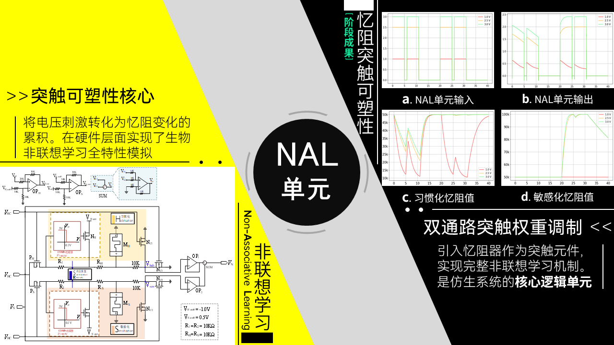
  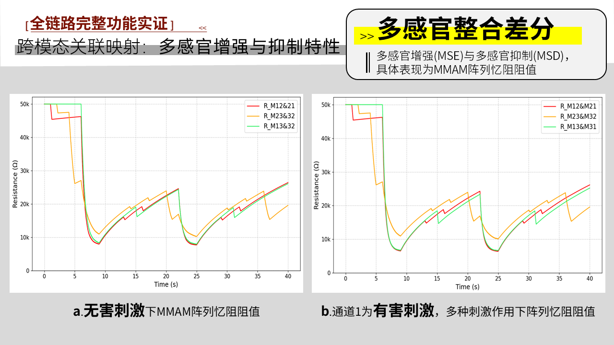
</p>
<p align="center"><em>左：NAL 四过程波形——习惯化衰减与敏感化/去习惯化跃变可见，说明前端通道可动态重编程。右：无害刺激下 MMAM 阵列阻值——三通道独立权值分化，共现增强写入成功。</em></p>

<p align="center">
  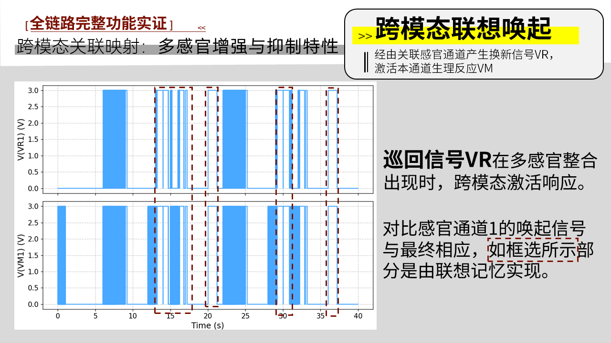
  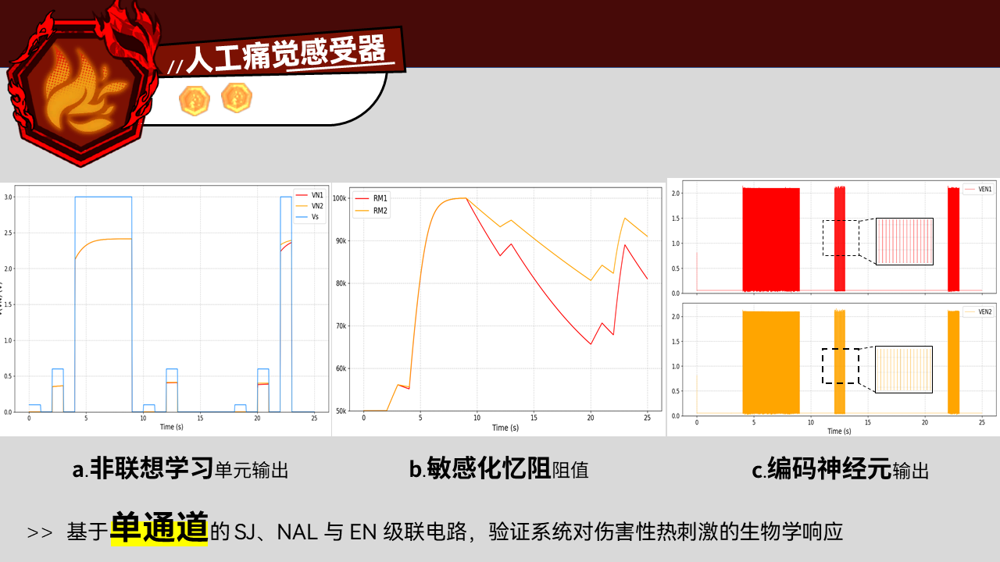
</p>
<p align="center"><em>左：VR 检索脉冲——单通道线索可唤醒关联通道，验证跨模态联想。右：人工痛觉感受器——阈值、发放、适应等特性与生物痛觉模型一致。</em></p>

---

## 🏆 核心贡献

| # | 贡献 | 标签 | 说明 |
|---|------|------|------|
| 1 | **完整 NAL 四过程** | `工程验证` | 习惯化 / 敏感化 / 去习惯化 / 自发恢复；同时考虑刺激**强度**与**价效** |
| 2 | **共存检测 + 方向性突触** | **`独立提出`** | 时域 Hebbian 前提判定（CD / AndCD），区分 a→b 与 b→a，非对称驱动忆阻阵列 |
| 3 | **MSE + MSD** | `工程验证` | 多感官共现增强、非共现抑制（多数文献仅 MSE） |
| 4 | **AIST 忆阻模型改进** | **`独立提出`** | 正/负向 Biolek 窗函数分离 + 越界保护；见 [忆阻模型改进](#忆阻模型改进) |
| 5 | **高级仿生扩展** | `应用拓展` | 人工痛觉感受器（5 特性）、语义饱和（方向性双通道联想） |

> 贡献 #2、#4 的**行业背景与难度说明**见各自专节；设计演进与过程材料见 [文档与过程材料](#-文档与过程材料)。

---

## 能力体现

对应 [核心贡献](#-核心贡献)，本项目在以下维度形成可迁移能力：

- **工程能力** — 全链路电路设计与 PSpice 仿真调试；多模块系统集成与 40 s 级联验证
- **创新能力** — 针对忆阻模型边界锁死、异步脉冲共现判定两个结构性痛点，提出原创模型改写与电路方案
- **问题解决** — 128 / 204 组会完整记录从现象定位 → 根因分析 → 方案验证的闭环过程
- **学术与工程素养** — 规范文档归档、可复现工程交付（OrCAD 工程 + 论文 + 仿真数据 + 后处理脚本）

---

## 个人工作边界

> 各工作的来源与性质划分如下：

| 标签 | 含义 | 具体内容 |
|:----:|:----:|----------|
|  | **原创** | 共存检测子电路（CD / AndCD）；方向性忆阻驱动（M12/M21/…）；Biolek 窗函数分向改进；语义饱和方向性联想方案 |
|  | **验证** | 三通道系统集成；NAL 四过程全测试；MSE/MSD/VR；人工痛觉感受器五特性 |
|  | **参考** | 多感官互联记忆（MMAM）总体框架与基础单元架构——见 [引用](#引用) |

> **探索性分支**：新奇度通路 → [`memtest/somethingnew/saikai.opj`](memtest/somethingnew/) · 见 [探索性分支](#探索性分支)

---

## 忆阻模型改进

> 技术依据：[`docs/presentations/group-meetings/128组会ppt.pptx`](docs/presentations/group-meetings/) · [`docs/design-notes/电路设计推进.md`](docs/design-notes/电路设计推进.md)  
> SPICE 实现：[`memristor/zy_memristor/memristor_zhang.lib`](memristor/zy_memristor/memristor_zhang.lib)  
> 

> **难度注解 · 为什么不是「调参」**  
> AIST/Biolek 类忆阻 SPICE 模型在 x→0 或 x→1 时，统一窗函数使变化率 Gx **恒为零**——这是数学形式的结构性缺陷，触界后忆阻不可逆，长时序 NAL（习惯化/敏感化循环）与 EN 频率编码均会失效。业界通用实现普遍未处理此问题；本改进需**改写 `.func` 窗函数定义**，而非调整 Ron/Roff 参数。

电路采用 AIST 阈值忆阻模型，用内部状态变量 **x** 表征阻值在 Ron–Roff 间的相对位置。在 EN（ME 忆阻）与 NAL（MS 忆阻）联调中，原始实现存在**边界锁死**：统一窗函数 `f(x,p)=1-(2x-1)^(2p)` 在 x→0 或 x→1 时使 Gx 恒为零，阻值既不能继续增大也不能反向减小。

**影响：** MS/ME 触 Ron 或 Roff 后停止响应；Rinit 无法设为 Ron/Roff；长时序 NAL/EN 测试失败。

**改进要点：** 正电压用 `f_inc`、负电压用 `f_dec` 分向约束边界；`stp()` 防止仿真步长导致 x 越界。改进后全部模块可稳定参与 40 s 系统级联调。

<details>
<summary><strong>SPICE 实现、对比表与过程证据</strong>（点击展开）</summary>

**改进方案：**

1. **分向窗函数**——正电压用 `f_inc`，负电压用 `f_dec`，分别约束上/下边界，契合 Biolek 原文中增阻/减阻表达式随电流方向变化的定义
2. **越界保护**——`stp()` 处理仿真步长导致的 x 滑出 (0,1) 区间

```spice
Gx 0 x value={ ... * f_inc(V(x),p) + ... * f_dec(V(x),p) }
.func f_inc(x,p)={1-x^(2*p)*stp(x)+stp(-x)}
.func f_dec(x,p)={1-(1-x)^(2*p)*stp(-x+1)+stp(x-1)}
```

| 对比项 | 原始模型 | 改进模型 |
|--------|----------|----------|
| 窗函数 | 单一 f(x,p)，x=0/1 双向锁死 | f_inc / f_dec 分向约束 |
| Rinit=Ron/Roff | 不可用 | 可用 |
| NAL/EN 边界行为 | 触界后失效 | 触界后可反向变化 |
| 数值鲁棒性 | x 越界时异常放大 | stp() 钳位保护 |

**过程证据（128 组会 → 设计笔记 → 联调）：**

| 证据 | 来源 | 说明 |
|------|------|------|
| 问题暴露 | [`电路设计推进.md`](docs/design-notes/电路设计推进.md) 特性 A/C 测试 | MS/ME 忆阻触 Ron/Roff 后阻值停止变化，NAL 四过程与 EN 编码均无法继续 |
| 根因分析 | 128 组会 Slide 7–8 · [`slide7_text.txt`](assets/07_memristor_model/slide7_text.txt) | 原始 `f(x,p)` 不区分加减方向，x=0/1 双向锁死 |
| 改进实现 | 128 组会 Slide 9–10 · `memristor_zhang.lib` | 分向 `f_inc`/`f_dec` + `stp()` 越界保护 |
| 验证结论 | 系统级 40 s 仿真 | 改进后 SJ / NAL / EN / MMAM 全部模块可稳定联调，是 Chapter 4 系统级测试的前提 |

</details>

---

## 共存检测与方向性突触

> 技术依据：[`docs/presentations/group-meetings/204组会ppt.pptx`](docs/presentations/group-meetings/) · [`docs/design-notes/关于突触链接建立的条件与方向性——MMAM单元前的判断机制.md`](docs/design-notes/)  
> 电路实现：`memtest/MMAM design/MMAM.opj`（图 2-7 共存检测 · 图 2-8 MMAM 单元）

本项目的**核心独立贡献之一** · 

> **难度注解 · 为什么不是「换一个与门」**  
> EN 采用**频率编码**后，各通道输出为等幅、异步、频率可不同的脉冲串——峰顶自然交错，硬件与门输出**恒为低**，Hebbian 写入无法触发。这是类脑脉冲编码与布尔逻辑之间的结构性冲突；参考 MMAM 框架默认脉冲已对齐，未给出异步场景解法。本设计需新建 CD 子电路（比较器 + DFF 时间窗 + 双信号分层），属**电路级新模块设计**，非参数微调。

在 MMAM 忆阻阵列写入之前，**独立设计并实现了共存检测子电路**，并配套**方向性突触门控**，解决异步脉冲条件下的赫布学习前提判定问题。

### 问题：简单与门无法判定"共现"

既有方案在 EN 与 MMAM 之间直接用与门判断"两路信号是否同时有效"。但经 EN **频率编码**后，各通道输出为等幅、异步、频率可不同的脉冲串——两路脉冲的峰顶往往**不在同一时刻**，与门输出恒为低，Hebbian 写入无法触发。

<p align="center">
  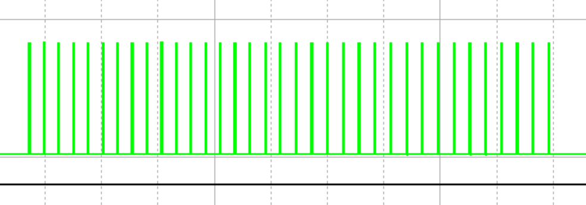
  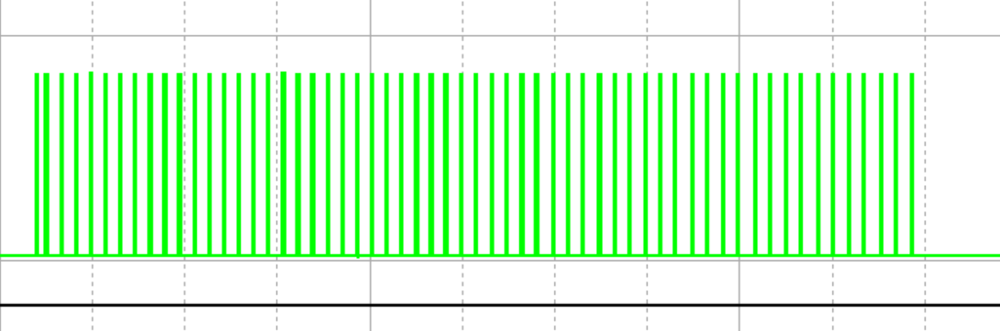
</p>

*上图：两通道 EN 输出脉冲串。刺激时段重叠，但脉冲峰顶交错——简单与门无法检出共现，而共存检测可以。*

参考框架中同类设计假设脉冲已对齐，可直接求与；本设计面向**刺激时段重叠、脉冲异步**的真实编码输出，需另建判定逻辑（详见 204 组会 Slide 4–5）。

### 生物学依据

突触可塑性的有效时间窗约为 **20 ms** 量级（Bi & Poo, 1998），远大于单个动作电位宽度。因此"共现"应理解为：**两路活动在有效时间窗内存在重叠**，而非要求脉冲逐峰对齐。

<details>
<summary><strong>信号分层、子模块链路与门控细节</strong>（点击展开）</summary>

#### 信号分层：VPERM 与 VNE

共存检测将 EN 输出拆为两类信号（204 组会 Slide 7）：

| 信号 | 含义 | 作用 |
|------|------|------|
| **VNE** | 编码后的原生脉冲（神经元放电） | 供 COMP 比较器检测两路脉冲是否**时域重叠** |
| **VPERM** | 覆盖整段刺激期的使能窗 | 作为 PMOS 门控：仅当两路使能窗**同时有效**时，才允许输出共现脉冲 |

VNE 回答"脉冲有没有碰上"，VPERM 回答"刺激期是否重叠"——两者共同构成比与门更完整的共现判定。

#### CD 模块：时域重叠检测

每对通道配置一个 **CD** 子模块（三通道系统含 CD1/CD2/CD3；OrCAD 网表标注为 EC1/EC2/EC3），核心链路：

```
VNEi + VNEj ──► COMP（比较器判定重叠）──► DFF（锁存时间窗）──► CDij 输出
```

- **COMP**：检测两路 VNE 在比较阈值以上是否存在时间重叠
- **DFF**：将重叠事件锁存为持续有效的时间窗（`VMEM` 状态）
- **CD 输出**：仅当「共现」成立时置高，作为后续 AndCD 的使能前提

论文图 2-7 即该子电路的完整原理图。

#### VENG：共现成立后的统一驱动

当两路 **VPERM 均为高**（刺激期重叠）时，PMOS 关断，比较器将整流后的 **VNE** 与阈值比较，输出统一强度的 **VENG**（3 V 脉冲）；任一 VPERM 为低则 VENG 恒为 0。该级确保"共现"转化为可用于驱动忆阻的标准脉冲。

<p align="center">
  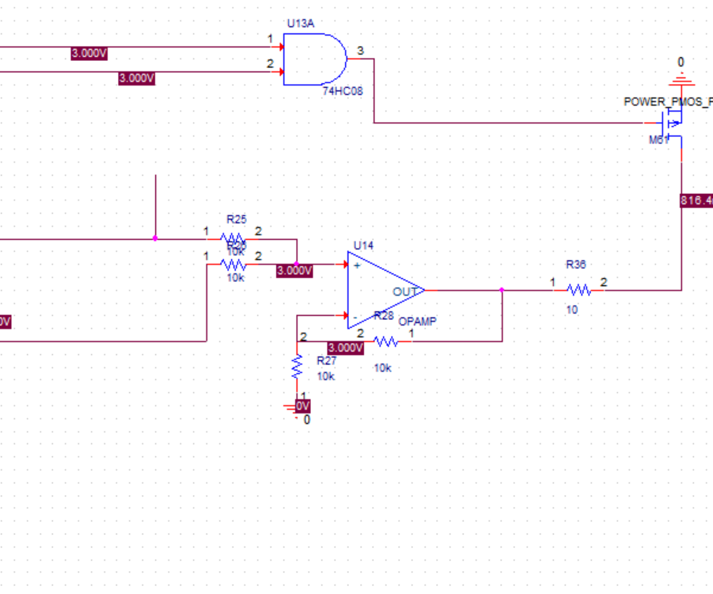
  <br><em>VPERM 门控 + VNE 整流比较 → VENG（204 组会 Slide 8–9）</em>
</p>

#### AndCD 门控与方向性突触

共现只说明「值得联想」，不说明「谁驱动谁」。**AndCD12 / AndCD13 / AndCD23**（网表标注 AndEC12 等）在 CD 使能下，分别只允许对应方向的突触电压通过：

| 门控 | 驱动忆阻 | 含义 |
|------|----------|------|
| AndCD12（AndEC12） | M12 | 通道 1 → 通道 2 联想增强 |
| AndCD21（AndEC21） | M21 | 通道 2 → 通道 1 联想增强 |
| AndCD13 / AndCD31（AndEC13 / AndEC31） | M13 / M31 | 通道 1 ↔ 通道 3 |
| AndCD23 / AndCD32（AndEC23 / AndEC32） | M23 / M32 | 通道 2 ↔ 通道 3 |

因此语义饱和等场景只需激活**单通道**脉冲即可写入方向性权重，无需两路平均。OrCAD 工程中以 `Mab: 从a唤醒b` 标注各方向。

</details>

### 仿真验证：方向性权值独立演化

<p align="center">
  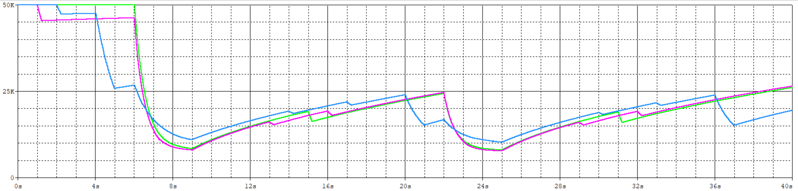
  <br><em>三对方向性忆阻（M21/M12、M23/M32、M31/M13）在 40 s 仿真中独立变化——共现时协同写入，单通道刺激时仅对应方向响应（204 组会 Slide 13）</em>
</p>

*解读：6.5 s 附近三路共现刺激触发协同阻值下降；36 s 附近仅蓝线（单通道）突降，绿/品红保持——证明方向性门控而非对称平均。*

<details>
<summary><strong>迭代过程证据</strong>（点击展开）</summary>

| 步骤 | 材料 | 量化 / 对比结论 |
|------|------|-----------------|
| ① 证明与门失效 | Slide 4 异步脉冲波形 | 刺激时段重叠，脉冲峰顶交错 → 与门恒低 |
| ② 信号分层设计 | Slide 7 · [方向性设计笔记](docs/design-notes/关于突触链接建立的条件与方向性——MMAM单元前的判断机制.md) | VNE（脉冲重叠）+ VPERM（刺激期重叠）双条件判定 |
| ③ 电路实现 | 图 2-7 · `MMAM.opj` | COMP + DFF 锁存 ~20 ms 有效窗（Bi & Poo, 1998） |
| ④ 方向性验证 | Slide 13 · 上方波形图 | **40 s** 仿真：6.5 s 共现协同写入 / 36 s 单通道仅对应方向响应 |
| ⑤ 系统里程碑 | 204 组会测试记录 | 首次实现 **40 s** 三通道完整电路稳定运行 |

</details>

### 概念与电路原理图

<p align="center">
  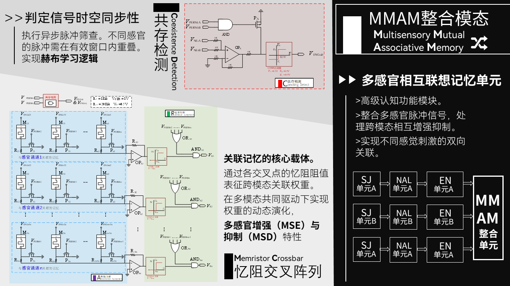
  <br><em>共存检测 + 方向性忆阻交叉阵列（结题 PPT）</em>
</p>

<table>
<tr>
<td width="50%">

**图 2-7 · 共存检测子电路**


DFF 锁存时间窗 + COMP 判定脉冲重叠；CD 输出作为 AndCD 使能，通过则允许赫布写入。

</td>
<td width="50%">

**图 2-8 · MMAM 单元**

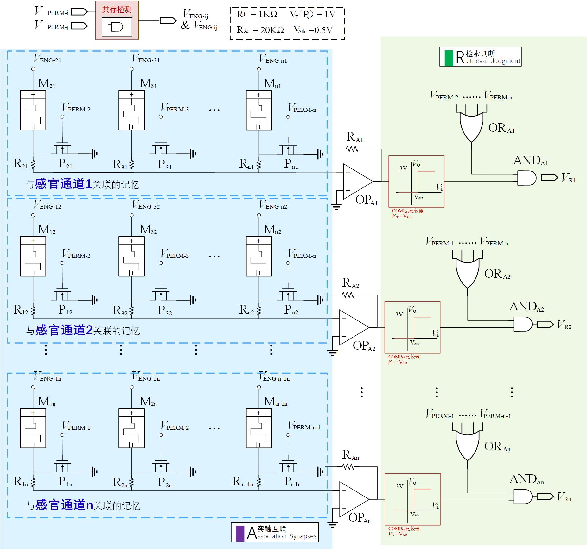

突触互联阵列 **A** 存储联想权重，检索判断 **R** 产生 VR；PMOS 门控区分增强/抑制通路。

</td>
</tr>
</table>

---

## 系统架构

### 总体思路 · 图 1-7

<p align="center">
  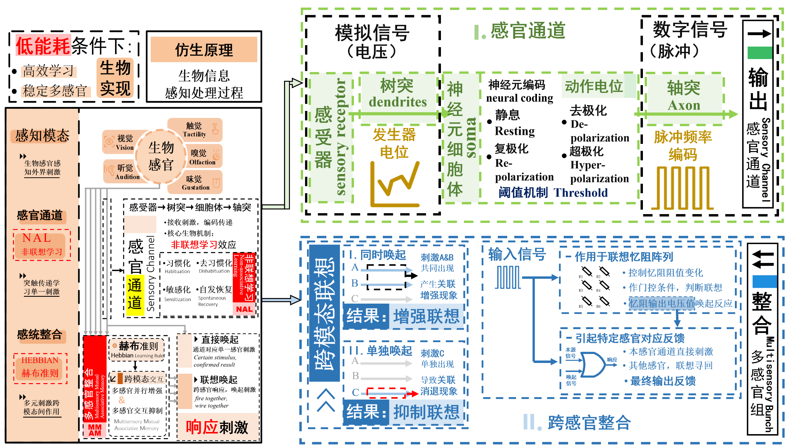
  <br><em>生物感知 → 非联想学习 → 赫布联想 / MMAM 信息流程</em>
</p>

```
多通道刺激 ──► 非联想学习 (NAL) ──► 脉冲编码 (EN)
                      │                    │
                      └──────► 共存检测 (CD) ──► 方向性 MMAM 忆阻阵列 ──► VR / VM
```

<details>
<summary><strong>四大模块功能表与工程截图</strong>（点击展开）</summary>

### 四大电路模块

<p align="center">
  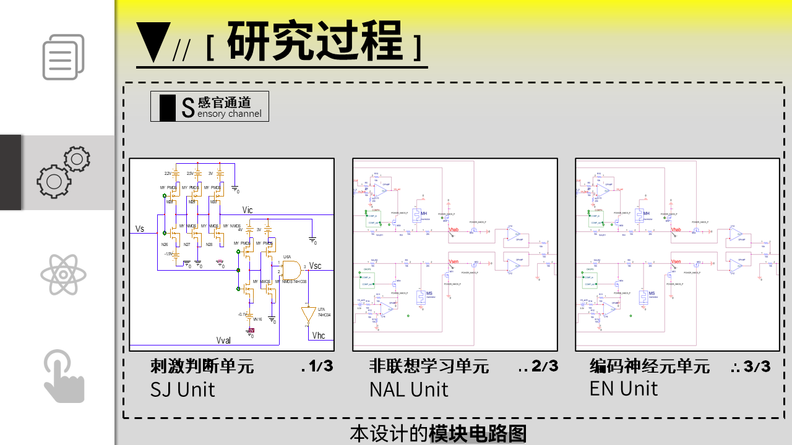
</p>

| 模块 | 功能 |
|------|------|
| **SJ** | 刺激强度阈值分类 + 价效（无害/有害）判断 |
| **NAL** | 习惯化 / 敏感化 / 去习惯化 / 自发恢复（忆阻 MH/MS） |
| **EN** | 电压→脉冲频率编码 + VM 使能 |
| **MMAM** | 共存检测（CD）门控 + 方向性忆阻阵列 → MSE / MSD / VR |

### 电路实现 · 三通道总体

<p align="center">
  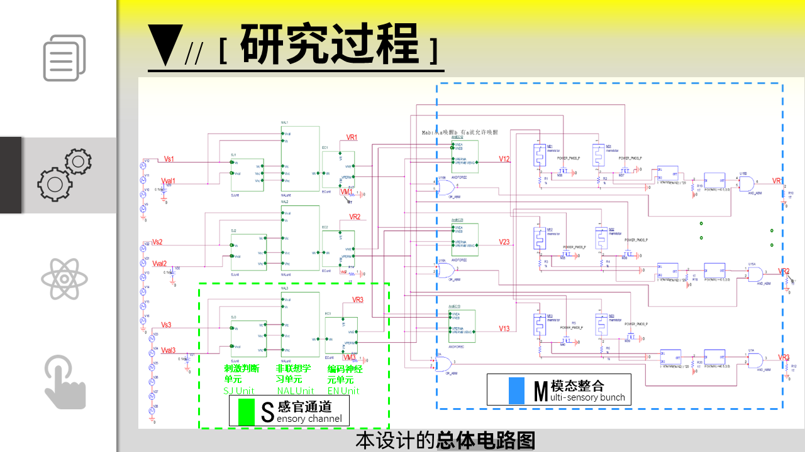
  <br><em>结题 PPT：SJ → NAL → EN → CD / AndCD → MMAM 系统总览</em>
</p>

<p align="center">
  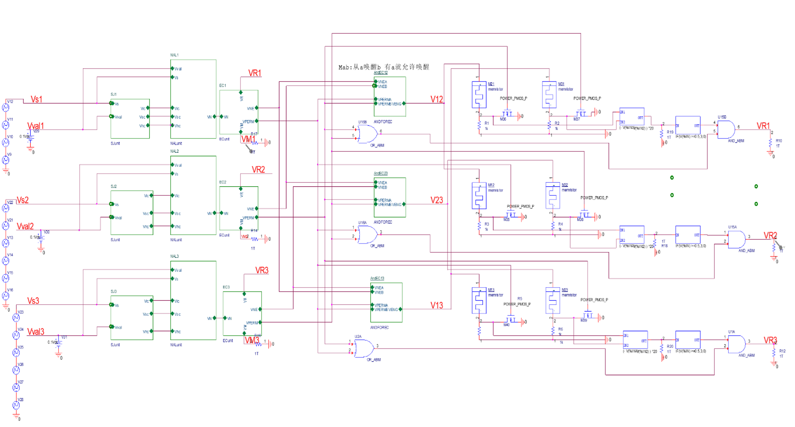
  <br><em>OrCAD 工程截图：含 <code>Mab: 从a唤醒b</code> 方向性标注的可仿真完整链路</em>
</p>

</details>

---

## 仿真结果

### 非联想学习（NAL）

<p align="center">
  
</p>

*关键解读：重复无害刺激下响应逐步衰减（习惯化）；有害/高强度刺激触发敏感化跃升；去习惯化与自发恢复段可见阻值/输出反弹，四过程在同一单元内闭环验证。*

### 多感官整合（MSE / MSD）

<p align="center">
  
  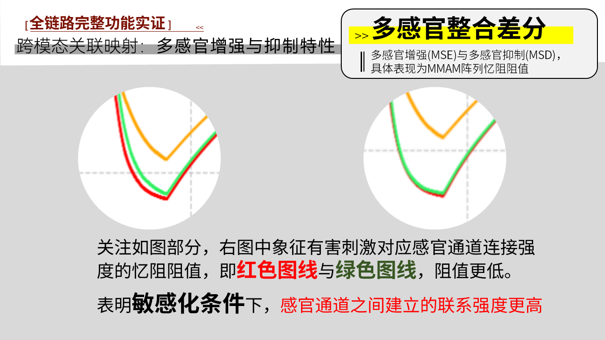
</p>

*左图：共现刺激下对应交叉忆阻阻值下降（LTP 写入），非共现位置保持高阻——MSE 增强与 MSD 抑制同时可见。右图：混合价效下敏感化调制 EN 输出频率，放大 MMAM 写入强度差异。*

<p align="center">
  
</p>

*单通道检索脉冲出现后，关联通道 VR 输出被唤醒；若联想未建立则 VR 保持静默——验证方向性存储可被选择性读取。*

---

## 拓展应用

> 基于 Chapter 5 电路架构，与核心系统并列验证信息处理能力；与 [核心贡献](#核心贡献) 中的系统级两大改动相互补充。

| 人工痛觉感受器 | 语义饱和 |
|:---:|:---:|
|  | 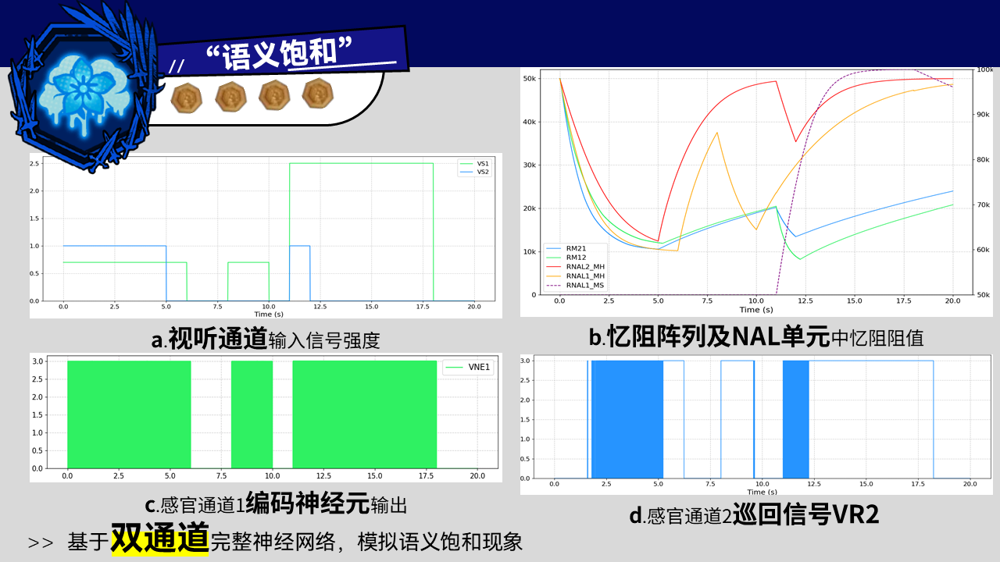 |

*痛觉：阈值、发放率递增、适应等五特性与生物模型对照通过。语义饱和：方向性联想下重复激活导致 VR 衰减，分步现象见 `assets/06_applications/semantic_satiation_step1~4.PNG`。*

---

## 与现有工作对比

<p align="center">
  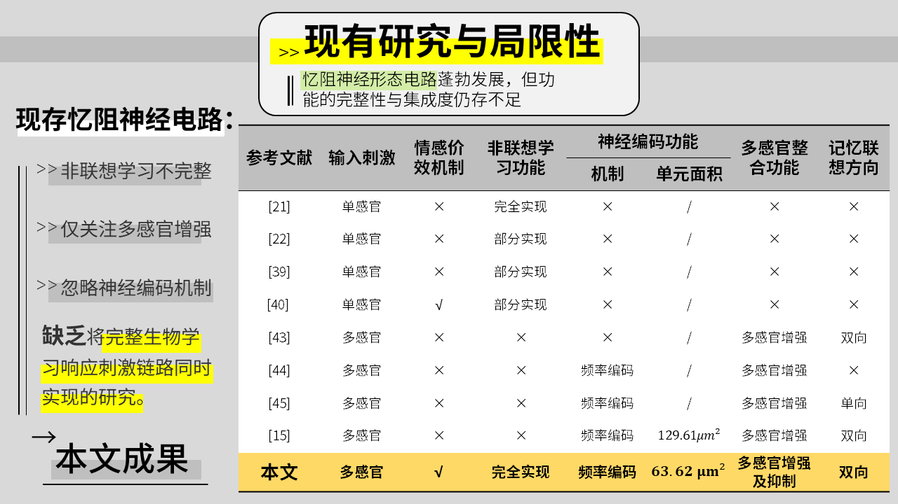
  <br><em>现有研究与局限性——本文在完整 NAL、MSE+MSD、频率编码 EN、双向联想等维度上的差异化（详见配图标注）</em>
</p>

**本文相对现有忆阻神经形态工作的增量：**

- 完整非联想学习四过程 + 价效调制，而非单一突触可塑性演示
- 多感官**增强与抑制**双向整合，而非仅 MSE
- 共存检测 + 方向性突触，支持异步脉冲下的可控联想写入
- 编码单元面积 63.62 μm²，约为对照工作 [15]（129.61 μm²）的一半

---

## 仓库结构

```
.
├── README.md
├── assets/                     # GitHub 展示图片（见 IMAGE_GUIDE.md）
├── circuits/                   # 工程入口说明（README）；实体工程见 memristor/、memtest/
├── simulation/                 # CSV 数据 + draw.py 绘图脚本
├── docs/
│   ├── thesis/                 # final / drafts / submitted
│   ├── presentations/          # final / group-meetings / proposal-midterm / working-drafts
│   ├── design-notes/           # 设计笔记（共存检测、忆阻模型、新奇度等）
│   ├── reports/                # 开题 / 中期 / 行政材料
│   ├── references/             # 生物学 / 忆阻 / 神经形态参考文献
│   └── archive/                # 原文档归档、Visio 源、仿真截图
├── memristor/  memtest/  memdataprocess/   # 原始工程目录（路径保持不变）
```

---

## 环境配置

**环境：** OrCAD Capture 23.x + PSpice · Python 3.10+（可选，用于 CSV 后处理）

```
1. 克隆仓库，安装 Python 依赖（可选）
   pip install -r simulation/requirements.txt

2. 打开核心工程
   memtest/MMAM design/MMAM.opj

3. 运行基础仿真
   选择 NAL 或 MMAM 测试配置 → Run PSpice → 查看波形

4. 导出并可视化（可选）
   导出 CSV → python simulation/scripts/draw.py --csv <file>
```

| 工程 | 路径 | 内容 |
|------|------|------|
| 三通道完整系统 | `memtest/MMAM design/MMAM.opj` | 最终集成仿真 |
| 忆阻 SPICE 库 | `memristor/zy_memristor/memristor_zhang.lib` | 改进 AIST 模型 |
| 语义饱和 | `memtest/yuyibaohe/SemanticSatiation.opj` | 方向性联想应用 |

**常见问题：** 仿真不收敛时可检查 EN 输出频率是否过高导致步长过小；整合电路中 MOS 阈值需按 [`docs/design-notes/电路设计推进.md`](docs/design-notes/电路设计推进.md) 微调；确认已加载改进版 `memristor_zhang.lib`。

---

## 📄 文档与过程材料

> 除最终成果外，亦完整记录了从问题暴露、方案推导到量化验证的设计过程，可按时间线追溯。

<details>
<summary><strong>设计演进时间线</strong>（点击展开）</summary>

| 阶段 | 材料 | 记录了什么 |
|------|------|------------|
| **发现问题** | [`128组会ppt.pptx`](docs/presentations/group-meetings/) · [`电路设计推进.md`](docs/design-notes/电路设计推进.md) | NAL/EN 联调中忆阻触界后停止响应；窗函数数学形式导致 Rinit=Ron/Roff 不可用 |
| **提出方案** | 128 组会 + [`memristor_zhang.lib`](memristor/zy_memristor/memristor_zhang.lib) | 分向 `f_inc` / `f_dec` + `stp()` 越界保护的设计推导与 SPICE 实现 |
| **暴露新问题** | [`204组会ppt.pptx`](docs/presentations/group-meetings/) · [`关于突触链接建立的条件与方向性…md`](docs/design-notes/关于突触链接建立的条件与方向性——MMAM单元前的判断机制.md) | 与门在异步脉冲下恒失败；需独立设计时域共现判定与方向性门控 |
| **迭代验证** | 204 组会 Slide 4–13 · [`MMAM.opj`](memtest/MMAM%20design/MMAM.opj) | 共存检测电路 → 40 s 系统仿真 → 方向性阻值在 6.5 s / 36 s 处分岔验证 |
| **成果归档** | [`docs/thesis/final/`](docs/thesis/final/) · [`docs/presentations/final/`](docs/presentations/final/) | 论文终稿 + 结题答辩完整叙事 |

**系统联调中的典型难点**（详见 [`电路设计推进.md`](docs/design-notes/电路设计推进.md)）：

| 问题 | 处理 |
|------|------|
| 整合仿真不收敛 | EN 脉冲频率过高导致步长过小 → 降频或按设计笔记微调 MOS 阈值 |
| 参考框架接线疏漏 | 三通道 MMAM 前级逻辑与原文不一致 → 对照论文自行修正并记录 |
| 非理想器件特性 | 部分比较器/门控在 PSpice 中行为偏离 → 以 ABM 行为源替代并标注妥协点 |

开题 / 中期 / 工作草稿 PPT 见 [`docs/presentations/`](docs/presentations/README.md)，用于追溯方案如何从初期构想演进至终版架构。

</details>

### 材料索引

| 类型 | 路径 | 内容说明 |
|------|------|----------|
| **论文终稿** | [`docs/thesis/final/`](docs/thesis/final/) | 完整学术叙事与系统验证结论 |
| **结题答辩** | [`docs/presentations/final/`](docs/presentations/final/) | 结题答辩完整展示 |
| **128 组会** | [`docs/presentations/group-meetings/128组会ppt.pptx`](docs/presentations/group-meetings/) | 忆阻模型边界锁死的问题发现、根因分析与改进推导 |
| **204 组会** | [`docs/presentations/group-meetings/204组会ppt.pptx`](docs/presentations/group-meetings/) | 共存检测从与门失效到 CD 电路的完整设计迭代与 40 s 验证 |
| **设计笔记** | [`docs/design-notes/`](docs/design-notes/) | 联调记录、突触方向性生物学依据、电路接线修正 |
| **阶段 PPT** | [`docs/presentations/`](docs/presentations/README.md) | 开题 / 中期 / 工作草稿，追溯方案演进 |
| **仿真数据** | [`simulation/data/`](simulation/data/) · [`draw.py`](simulation/scripts/draw.py) | PSpice 导出 CSV 与 Python 后处理脚本 |
| **素材索引** | [`assets/IMAGE_GUIDE.md`](assets/IMAGE_GUIDE.md) | README 配图与组会/论文图源对照 |

---

## 探索性分支

[`memtest/somethingnew/saikai.opj`](memtest/somethingnew/) 实现了基于电容微分的新奇度检测通路（VNOV 并联叠加 + CMOPS 学习门控），设计说明见 [`docs/design-notes/非联想学习神经形态电路的生物合理性改进：引入新奇度机制.txt`](docs/design-notes/)。

该分支为**扩展功能**的原理级原型，因开发周期未纳入主系统验证，保留作为后续研究方向。

---

## 引用

如引用或复用本仓库内容，请注明：

> 蒋彦熙. 面向多感官调制的非联想学习忆阻神经形态电路设计的研究. 哈尔滨工业大学, 2026.

主要参考框架：

> Zhang Y., et al. *The Framework and Memristive Circuit Design for Multisensory Mutual Associative Memory Networks*. IEEE Transactions on Cybernetics, 2022.

---

## License

学术归档用途。论文版权归哈尔滨工业大学/作者所有。
